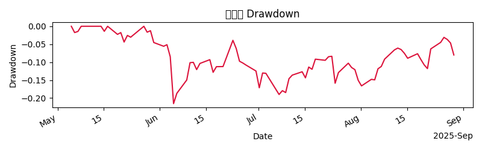

# Investment Analysis Report (English)

## Executive Summary

- Target Asset: Tesla (TSLA)
- Current Status & Recommendation: Maintain HOLD, with a current target portfolio weight of 6%. There is a plan to gradually reduce the position to reach the target weight. Risk and return remain within a controllable range; VaR shows risk is at an acceptable level. The current price and market sentiment are neutral to slightly cautious.
- Key Points: The company has sustainable revenue streams and potential for profit improvement, but industry competition, raw material volatility, and regulatory environment remain uncertainties. Based on the current build schedule and liquidity constraints, a phased entry approach is proposed to minimize single-day impact.

## Research Thesis

- Supporting View: As a leader in the electric vehicle and energy transition wave, Tesla has a vertically integrated production chain, a global charging network, and a robust software ecosystem. Capacity expansion and margin improvement will support long-term growth and profitability.
- Risks & Margins: Intensified industry competition, raw material cost fluctuations, supply chain and regulatory uncertainties, and the uncertain commercialization of autonomous driving may suppress expansion speed and profit levels.
- Moat Evaluation: Composite moat (vertical integration, charging network, software ecosystem, economies of scale, platform-driven high capital return potential).
- Valuation & Outlook: DCF as the core method, with Bear/Base/Bull scenarios. Key drivers include margin improvement, software revenue expansion, and increased capacity utilization.

## Portfolio Proposal

- Target Weight: 6% (0.06)
- Build Schedule (Phased entry by date):
  - 2025-09-15: Reduce position by -4% (-0.04)
  - 2025-10-15: Reduce position by -3% (-0.03)
  - 2025-11-15: Reduce position by -2% (-0.02)
    Note: The above are phased adjustments to gradually reach the target weight and achieve a smooth transition.
- Liquidity & Execution Rules
  - adv_multiple: 2.0x (twice the average daily volume as a cumulative participation guideline, but not exceeding the limit in a single day)
  - days_to_build: 60 days
- Constraints (expressed as percentages, with one-line rationales)
  - max_single_name: 0.06 (no single security exceeds 6% of the portfolio, to control concentration risk)
  - sector_cap: 0.20 (sector limit at 20%, to maintain diversification)
- Price & Forecast
  - Current price context: Latest price 333.86, as of 2025-08-30 00:01:00Z; daily change -3.5%
  - 30-day/90-day ADV: N/A
  - Forecast: N/A
- Current Price Background (price info from market summary)

  - Latest price text: TSLA latest price (2025-08-30T00:01:00Z): 333.86 (-350.00%)
  - Latest time: 2025-08-30T00:01:00Z
  - Daily price change: -3.5%

- Note: If the current position does not match the target weight, exposure will be gradually reduced to the target weight according to the reduction schedule above. If there is an existing position, active_weight should be expressed as position_size - target_weight.

- Addendum (Key Metrics)
  - active_weight (active weight deviation): 0.15 - 0.06 = 0.09, approximately 9.0 percentage points (current position 15%, target 6%, needs to be reduced by 9pp)
  - present_horizon_holding (strategy holding period): Please refer to horizon_days (30 days) as stipulated in Advice Details. Do not confuse with days_to_build for position building.

## Risk & Compliance

- VaR (Risk Metric) Standard: VaR(95%, 1-day, portfolio-level, scaled by target weight)
- Current Risk Level: VaR_95 is 3.09% (0.0309), below the 3.5% threshold; risk exposure is within acceptable range.
- Risk Trends & Scenarios (based on provided data): Stress scenarios include drawdowns of approximately -4.2% in 2008 and -2.7% during COVID-2020, with no breached warnings.
- VaR Chart (embedded):  
  

- Other Compliance & Risk Points:

  - Risk check (riskCheck) shows no major violations triggered, maximum drawdown not specifically provided, current status is no breach.
  - Compliance check (complianceCheck): Unrestricted, approval granted (auto-pass).

- Risk & Compliance Summary: Under target weight and build schedule, risk exposure is controlled within acceptable range, and execution plans such as TWAP are used to minimize market impact.

- Charts for Reference: Charts only display price and drawdown; VaR chart is shown only in the Risk section.

## Trading Plan

- Strategy Algorithm: TWAP (Time-Weighted Average Price)
- Trading Benchmark: TWAP benchmark, aiming for low implementation costs
- Estimated Transaction Cost: About 18.0 basis points (bps)
- Execution Points: Enter position in phases according to the Build Schedule, follow adv_multiple and days_to_build constraints, and ensure intraday liquidity and slippage are within acceptable limits.

## Advice Details (if any recommendations present)

- Recommendation: HOLD
- Target Price: 350.0
- Position Size & Weight: position_size = 0.15; target_weight = 0.06; active_weight = position_size - target_weight = 0.09 (9.0 percentage points)
- Stop-Loss & Take-Profit: Both are multiples relative to entry price
  - stop_loss = 0.9 indicates -10% (stop loss triggered at 10% drop)
  - take_profit = 1.2 indicates +20% (take profit triggered at 20% rise)
- Position Explanation: Current position at 15% versus a target of 6%; the plan is to gradually reduce exposure to the target weight via phased reduction (as per the negative adjustments in the build schedule).
- Distinction between position horizon and build period: horizon_days (30 days) is for evaluation/holding period; days_to_build (60 days) is the execution window for reaching the target weight; adv_multiple describes cumulative participation, not exceeding 100% of ADV on a single day.
- Catalytic & Risk Factors (from input)
- Catalysts: New model launches, global expansion plans, technological innovation
- Key Risks: Escalating market competition, macroeconomic volatility, supply chain issues

- Other Notes: If there is an existing position differing from the target weight, the schedule indicates the direction of exposure adjustment; in this case, the main action is to reduce exposure to reach the target weight.

- Market Sentiment & Environment (Market Context)

  - Sentiment tag: Neutral
  - Headline summary: Includes multiple headlines on Tesla’s AI topics, macro market news, etc. Market sentiment is neutral to slightly cautious.

- Reference Market Background (from Market Context summary)

## Market Context (MCP)

- Current Market Sentiment & Environment: Neutral. Headlines from the past 7 days indicate investor sentiment has not formed a clear signal. Market focus on Tesla includes new models, global expansion, autonomous driving developments, and AI topics.
- Price & Volume Background: Based on latest prices, daily fluctuations, and market news, short-term volatility is increasing, but long-term growth potential remains.
- Risk Warnings: Macroeconomic volatility, policy changes, and supply chain disruptions remain primary sources of short-term risk.

- Price Chart & Performance (see Charts section for price and drawdown images)

## Charts

- Price & Trend Charts:
  - Price Chart: 
  - Drawdown/Risk Chart: 
- Note: The VaR chart in Risk & Compliance is shown only in the risk section and not repeated in Charts.

## Methodology / Process

- Data Sources & Inputs: Based on structured information from case/advice/market summaries (research memos, proposals, risk compliance, market summaries, etc.).
- Risk Assessment: Uses VaR(95%, 1-day, portfolio-level, scaled by target weight) as the core risk metric, alongside stress scenarios and historical extremes.
- Construction & Execution: Adopts a phased build schedule (days_to_build) and cumulative participation (adv_multiple) principles to ensure target weight is reached under specified liquidity constraints.
- Compliance & Approval: Follows risk and compliance check results to ensure trading plans (TWAP, cost control, position adjustment) are executed within approved limits.
- Monitoring & Updates: Regularly updates prices, risk metrics, and market sentiment; adjusts build_schedule and active_weight as needed.

## References

- Tesla Official Website
  - https://www.tesla.com
- Tesla 2023 Form 10-K
  - https://www.sec.gov/ixviewer/doc?action=display&docId=0001318605-23-000000
- Tesla Autopilot & Software Ecosystem Analysis
  - https://example.com/tesla-autopilot-analysis
- With the S&P 500 at Historically High Levels, This ETF Could Be the Best Way to Invest in the Index
  - https://www.fool.com/investing/2025/08/31/with-the-sp-500-at-historically-high-levels-this/?source=iedfolrf0000001
- 4 "Ten Titans" Stocks Are Already in the Dow Jones. Could the Rest Join by 2030?
  - https://www.fool.com/investing/2025/08/30/4-ten-titans-growth-stocks-dow-jones-2030/?source=iedfolrf0000001
- Elon Musk Sees Scientists Flee X As Bluesky Becomes Hotbed For Original Research And Higher Engagement
  - https://www.benzinga.com/news/social-media/25/08/47430085/elon-musk-sees-scientists-flee-x-as-bluesky-becomes-hotbed-for-original-research-and-higher-eng
- NIO Just Got Its Second Upgrade of the Month, and It’s Big
  - https://www.investing.com/analysis/nio-just-got-its-second-upgrade-of-the-month-and-its-big-200666151
- E-Mini S&P 500 Map Suggests Neutral-to-Bearish Outlook Ahead of Cycle Low
  - https://www.investing.com/analysis/emini-sp-500-map-suggests-neutraltobearish-outlook-ahead-of-cycle-low-200666147
- Other Tesla news and analysis links
  - https://www.investing.com/analysis/did-nvidia-meet-investors-expectations-in-q2-200666142
  - https://www.investing.com/analysis/snowflakes-snowballing-business-and-robust-stock-price-outlook-200666113
  - https://www.fool.com/investing/2025/08/29/1-stock-could-soar-650-to-cathie-woods-ark-invest/?source=iedfolrf0000001
  - https://www.fool.com/investing/2025/08/27/teslas-ai-hype-is-doing-the-heavy-lifting-for-the/?source=iedfolrf0000001
  - https://www.investing.com/analysis/emini-sp-500-map-suggests-neutraltobearish-outlook-ahead-of-cycle-low-200666147
  - And more public information related to Tesla, AI, and autonomous driving (see link list)
- Risk Chart: figs/var_curve.png

Note: All information above is based on provided input data and market summaries, with no fabricated or substituted data. Please cross-check with the latest disclosures and market data for actual investment decisions.

## References

- [Tesla Official Website](https://www.tesla.com)
- [Tesla 2023 Form 10-K](https://www.sec.gov/ixviewer/doc?action=display&docId=0001318605-23-000000)
- [Tesla Autopilot & Software Ecosystem Analysis](https://example.com/tesla-autopilot-analysis)
- [With the S&P 500 at Historically High Levels, This ETF Could Be the Best Way to Invest in the Index](https://www.fool.com/investing/2025/08/31/with-the-sp-500-at-historically-high-levels-this/?source=iedfolrf0000001)
- [4 "Ten Titans" Stocks Are Already in the Dow Jones. Could the Rest Join by 2030?](https://www.fool.com/investing/2025/08/30/4-ten-titans-growth-stocks-dow-jones-2030/?source=iedfolrf0000001)
- [Elon Musk Sees Scientists Flee X As Bluesky Becomes Hotbed For Original Research And Higher Engagement](https://www.benzinga.com/news/social-media/25/08/47430085/elon-musk-sees-scientists-flee-x-as-bluesky-becomes-hotbed-for-original-research-and-higher-eng)
- [NIO Just Got Its Second Upgrade of the Month, and It’s Big](https://www.investing.com/analysis/nio-just-got-its-second-upgrade-of-the-month-and-its-big-200666151)
- [E-Mini S&P 500 Map Suggests Neutral-to-Bearish Outlook Ahead of Cycle Low](https://www.investing.com/analysis/emini-sp-500-map-suggests-neutraltobearish-outlook-ahead-of-cycle-low-200666147)
- [Did Nvidia Meet Investors’ Expectations in Q2?](https://www.investing.com/analysis/did-nvidia-meet-investors-expectations-in-q2-200666142)
- [Snowflake: Snowballing Business Alongside Robust Stock Price Outlook](https://www.investing.com/analysis/snowflakes-snowballing-business-and-robust-stock-price-outlook-200666113)
- [1 Super Stock That Could Soar 650%, According to Cathie Wood's Ark Invest](https://www.fool.com/investing/2025/08/29/1-stock-could-soar-650-to-cathie-woods-ark-invest/?source=iedfolrf0000001)
- [Here's What Lucid's 1-for-10 Reverse Stock Split Means for Investors](https://www.fool.com/investing/2025/08/28/what-lucid-reverse-stock-split-means-lcid/?source=iedfolrf0000001)
- [Elon Musk’s Role in America’s Push Toward AI 2.0?](https://www.globenewswire.com/news-release/2025/08/28/3141071/0/en/Elon-Musk-s-Role-in-America-s-Push-Toward-AI-2-0.html)
- [1 Incredible Reason to Buy Rivian Stock Before Nov. 11](https://www.fool.com/investing/2025/08/28/1-incredible-reason-to-buy-rivian-before-nov-11/?source=iedfolrf0000001)
- [Amazon: Stock's Chart Just Flashed a Pennant Pattern—Here’s What to Do](https://www.investing.com/analysis/amazon-stocks-chart-just-flashed-a-pennant-patternheres-what-to-do-200666027)
- [Tesla's AI Hype Is Doing the Heavy Lifting for the Stock, but It Won't Be Enough for Long](https://www.fool.com/investing/2025/08/27/teslas-ai-hype-is-doing-the-heavy-lifting-for-the/?source=iedfolrf0000001)
- [Buffett Indicator at 213% Suggests US Stocks Are Deep Into Overvalued Territory](https://www.investing.com/analysis/buffett-indicator-at-213-suggests-us-stocks-are-deep-into-overvalued-territory-200666004)
- [Polestar Stock Is Trending Wednesday: What's Going On?](https://www.benzinga.com/trading-ideas/movers/25/08/47368473/polestar-stock-is-trending-wednesday-whats-going-on)
- [BYD Has Big Plans to Sell Half Its Vehicles Outside of China by 2030. Is This a Once in a Lifetime Investment Opportunity?](https://www.fool.com/investing/2025/08/27/byd-has-big-plans-to-sell-half-its-vehicles-outsid/?source=iedfolrf0000001)
- [2 of Wall Street's Highest-Flying Artificial Intelligence (AI) Stocks Can Plunge Up to 94%, According to Select Analysts](https://www.fool.com/investing/2025/08/27/2-wall-street-ai-stocks-plunge-up-to-94-analysts/?source=iedfolrf0000001)
- [Steepening Yield Curve Signals Big Moves in Long-Term Treasuries](https://www.investing.com/analysis/steepening-yield-curve-signals-big-moves-in-longterm-treasuries-200665941)
- [Tesla Just Had Its Best Day in 2 Months—Here’s What It Means](https://www.investing.com/analysis/tesla-just-had-its-best-day-in-2-monthsheres-what-it-means-200665939)
- [Tesla Stock 'Could Fall 90% Tomorrow,' Fund Manager Still Won't Buy — Here's Where He's Investing Instead](https://www.benzinga.com/markets/large-cap/25/08/47346429/tesla-stock-could-fall-90-tomorrow-fund-manager-still-wont-buy-heres-where-hes-investing-instea)
- [0001104659-25-084935](https://www.sec.gov/Archives/edgar/data/0001318605/000110465925084935/xslF345X05/tm2524512-1_4seq1.xml)
- [0001104659-25-073753](https://www.sec.gov/Archives/edgar/data/1318605/000110465925073753/xslF345X05/tm2522507-1_4seq1.xml)
- [0001104659-25-073263](https://www.sec.gov/Archives/edgar/data/1318605/000110465925073263/tm2522385d1_8k.htm)
- [0001628280-25-035738](https://www.sec.gov/Archives/edgar/data/1318605/000162828025035738/tsla-20250723.htm)
- [0001104659-25-068165](https://www.sec.gov/Archives/edgar/data/1318605/000110465925068165/xslF345X05/tm2520998-1_4seq1.xml)
- [0001628280-25-034692](https://www.sec.gov/Archives/edgar/data/1318605/000162828025034692/tsla-20250709.htm)
- [0001104659-25-066775](https://www.sec.gov/Archives/edgar/data/1318605/000110465925066775/xslF345X05/tm2520098-1_4seq1.xml)
- [0001628280-25-033842](https://www.sec.gov/Archives/edgar/data/1318605/000162828025033842/tsla-20250702.htm)
- [0001628280-25-035806](https://www.sec.gov/Archives/edgar/data/1318605/000162828025035806/tsla-20250630.htm)
- [0001972928-25-000003](https://www.sec.gov/Archives/edgar/data/1318605/000197292825000003/xslF345X05/edgardoc.xml)
