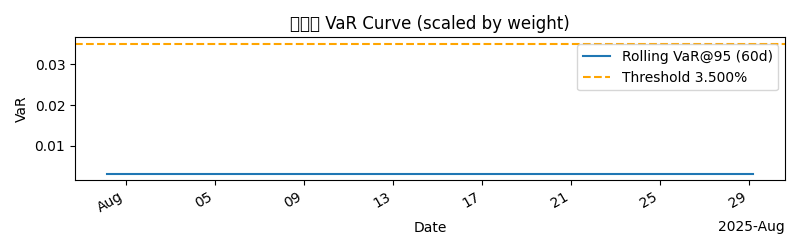
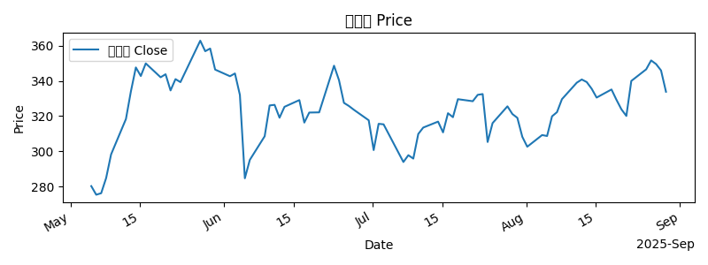
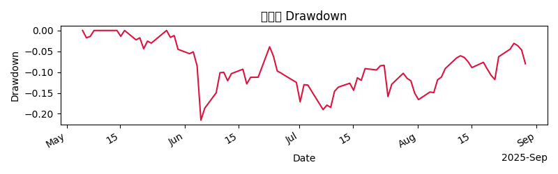

# 投资分析报告（中文）

## 摘要

- 目标资产：特斯拉（TSLA）
- 现状与建议：维持持有（HOLD），当前目标仓位为 6%，存在逐步减仓的计划以达到目标权重。风险与收益在可控区间内，VaR 显示风险水平在可接受范围内，当前价位与市场情绪呈中性偏谨慎态势。
- 核心要点：公司具备持续增长的收入来源与盈利改善潜力，但行业竞争、原材料波动及监管环境仍构成不确定性。基于现有建仓节奏与流动性约束，拟用分阶段进入方式降低单日冲击。

## 研究命题（Research Thesis）

- 支持观点：在电动车与能源转型大潮中，Tesla 拥有垂直整合的生产链、全球充电网络与强大的软件生态，产能扩张与毛利率提升将支撑长期增长与盈利能力的改善。
- 风险与边际：行业竞争加剧、原材料成本波动、供应链与监管不确定性，以及自动驾驶商业化进展的不确定性，可能压制扩张速度和利润水平。
- 护城河评估：综合护城河（垂直整合、充电网络、软件生态、规模效应、平台化高资本回报潜力）。
- 估值与前景：以 DCF 为核心方法，存在 Bear/Base/Bull 三种情景，核心驱动来自毛利率提升、软件收入扩张以及产能利用率提升。

## 组合提案（Portfolio Proposal）

- 目标权重（target_weight）：6%（0.06）
- 建仓计划（Build Schedule，分阶段按日期进入）：
  - 2025-09-15：减仓/减仓幅度 -4%（-0.04）
  - 2025-10-15：减仓幅度 -3%（-0.03）
  - 2025-11-15：减仓幅度 -2%（-0.02）
    注释：以上为逐步进入目标权重的阶段性调整，以实现平滑持仓转换。
- 流动性与执行规则（Liquidity & Execution）
  - adv_multiple（ADV 乘数）：2.0x（日常参与量的两倍作为累积参与指南，非单日超限）
  - days_to_build（构建期）: 60 天
- 约束条件（Constraints）（以百分比表示，附一行理由）
  - max_single_name：0.06（单一证券最多占组合的 6%，以控制单个持仓集中风险）
  - sector_cap：0.20（行业板块上限 20%，以维持分散化）
- 价格与预测（Price & Forecast）
  - 当前价格 context：最新价格 333.86，时间 2025-08-30 00:01:00Z；日变动 -3.5%
  - 30 日/90 日 ADV：N/A
  - 预测：N/A
- 当前价位背景（价格信息来自市场摘要）

  - 最新价文本：TSLA latest price (2025-08-30T00:01:00Z): 333.86 (-350.00%)
  - 最新时间：2025-08-30T00:01:00Z
  - 当日涨跌幅：-3.5%

- 备注：若当前持仓与目标权重不一致，将按上述减仓节奏逐步减少敞口至目标权重；若已有头寸，则 active_weight 需以 position_size - target_weight 的方式表示。

- 附注（关键指标）
  - active_weight（活跃权重偏离度）：0.15 - 0.06 = 0.09，约 9.0 个百分点（当前头寸 15%、目标 6%，需减少 9pp）
  - present_horizon_holding（策略 holding 期）：请参考 horizon_days（30 天）在 Advice Details 中的约定，勿混淆建设期 days_to_build。

## 风险与合规（Risk & Compliance）

- VaR（风险度量）口径：VaR(95%, 1-day, portfolio-level, scaled by target weight)
- 当前风险水平：VaR_95 为 3.09%（0.0309），低于 3.5% 的阈值；风险暴露在可接受区间。
- 风险趋势与情景（基于提供数据）：压力情景包括 2008 年与 COVID-2020 的回撤分别为约 -4.2% 与 -2.7%，无 breached 警示。
- VaR 图（嵌入式）：  
  

- 其他合规与风险要点：

  - 风险检查（riskCheck）显示未触发重大违背，最大回撤未给出具体数值，当前状态为无 breach。
  - 合规检查（complianceCheck）：未受限，审批通过（auto-pass）。

- 风险与合规小结：在目标权重及建仓节奏下，风险暴露控制在可接受区间，且经过 TWAP 等执行计划以降低市场冲击。

- 图表用于参考：Charts 仅在 Charts 部分展示价格与回撤等图形，VaR 图不重复。

## 交易计划（Trading Plan）

- 策略算法：TWAP（时间加权平均价格）
- 交易基准：TWAP 基准，目标实现成本控制在较低水平
- 预计交易成本：约 18.0 基点（bps）
- 执行要点：按照 Build Schedule 的阶段性进入进行，遵循 adv_multiple 与 days_to_build 的约束，确保日内流动性与滑点控制在可接受范围内。

## Advice Details（若存在建议内容）

- 建议结论：HOLD
- 目标价格：350.0
- 持仓规模与权重：position_size = 0.15；target_weight = 0.06；active_weight = position_size - target_weight = 0.09（9.0 百分点）
- Stop-Loss 与 Take-Profit：stop_loss 与 take_profit 均为相对进入价的乘数
  - stop_loss = 0.9 表示 -10%（下跌 10% 时触发止损）
  - take_profit = 1.2 表示 +20%（上涨 20% 时触发止盈）
- 持仓解释：当前头寸 15% 与目标 6% 存在差异，计划通过分阶段进入/减少（按建仓计划中的负向变动）来逐步降低敞口至目标权重。
- 持仓 horizon 与构建期区分：horizon_days（30 天）用于评估/持有期；days_to_build（60 天）仅用于执行窗口完成目标权重的计划；adv_multiple 描述的是累积参与度的指导，而非单日占比超过 100% 的执行。
- catalytic 与 risk factors（来自输入）
- Catalysts：新车型发布、全球扩张计划、技术创新
- 关键风险：市场竞争加剧、宏观经济波动、供应链问题

- 其他说明：若当前头寸存在且与目标权重不同， schedules 将指示增减敞口的方向；本案将以减少敞口为主，以达到目标权重。

- 市场情绪与市场环境（Market Context）

  - 情绪标签：中性（Neutral）
  - 头条摘要：包括对 Tesla 的 AI 话题、宏观市场新闻等多条头条，市场情绪呈现中性偏谨慎态势。

- 参考市场背景（来自 Market Context 提供的摘要）

## 市场情景（Market Context, MCP）

- 当前市场情绪与环境：中性（Neutral），过去 7 天的新闻头条显示投资者情绪尚未形成明确信号。市场对特斯拉的关注点集中在新车型、全球扩张、自动驾驶相关发展和 AI 相关议题上。
- 价格与成交背景：结合最新价格与日内波动，以及市场新闻的综合影响，短期波动加大，但长期增长潜力仍在。
- 风险提示：宏观经济波动、政策变化、供应链波动等因素仍是影响短期波动的主要来源。

- 价格图与表现（请参考 Charts 部分的价格与回撤图像）

## 图表（Charts）

- 价格与趋势图：
  - 价格图： 
  - 回撤/风险图： 
- 注：Risk & Compliance 中的 VaR 图单独在风险章节内展示，Charts 部分不重复展示。

## 方法论 / 流程（Methodology / Process）

- 数据来源与输入：基于 case/advice/market summaries 的结构化信息（研究 memo、提案、风险合规、市场摘要等）。
- 风险评估：使用 VaR(95%, 1-day, portfolio-level, scaled by target weight) 作为核心风险指标，并结合压力情景与历史极端事件进行评估。
- 构建与执行：采用分阶段建仓日程（days_to_build）与累积参与度（adv_multiple）的原则，确保在规定的流动性约束下逐步达到目标权重。
- 合规与審批：遵循风险与合规检查结果，确保在批准范围内执行交易计划（TWAP、成本控制、头寸调整）。
- 监控与更新：定期更新价格、风险指标与市场情绪，必要时调整 build_schedule 与 active_weight。

## 参考资料（References）

- Tesla 官方网站
  - https://www.tesla.com
- Tesla 2023 Form 10-K
  - https://www.sec.gov/ixviewer/doc?action=display&docId=0001318605-23-000000
- Tesla 自动驾驶与软件生态分析
  - https://example.com/tesla-autopilot-analysis
- With the S&P 500 at Historically High Levels, This ETF Could Be the Best Way to Invest in the Index
  - https://www.fool.com/investing/2025/08/31/with-the-sp-500-at-historically-high-levels-this/?source=iedfolrf0000001
- 4 "Ten Titans" Stocks Are Already in the Dow Jones. Could the Rest Join by 2030?
  - https://www.fool.com/investing/2025/08/30/4-ten-titans-growth-stocks-dow-jones-2030/?source=iedfolrf0000001
- Elon Musk Sees Scientists Flee X As Bluesky Becomes Hotbed For Original Research And Higher Engagement
  - https://www.benzinga.com/news/social-media/25/08/47430085/elon-musk-sees-scientists-flee-x-as-bluesky-becomes-hotbed-for-original-research-and-higher-eng
- NIO Just Got Its Second Upgrade of the Month, and It’s Big
  - https://www.investing.com/analysis/nio-just-got-its-second-upgrade-of-the-month-and-its-big-200666151
- E-Mini S&P 500 Map Suggests Neutral-to-Bearish Outlook Ahead of Cycle Low
  - https://www.investing.com/analysis/emini-sp-500-map-suggests-neutraltobearish-outlook-ahead-of-cycle-low-200666147
- Tesla 的新闻与分析相关链接（其他参考）
  - https://www.investing.com/analysis/did-nvidia-meet-investors-expectations-in-q2-200666142
  - https://www.investing.com/analysis/snowflakes-snowballing-business-and-robust-stock-price-outlook-200666113
  - https://www.fool.com/investing/2025/08/29/1-stock-could-soar-650-to-cathie-woods-ark-invest/?source=iedfolrf0000001
  - https://www.fool.com/investing/2025/08/27/teslas-ai-hype-is-doing-the-heavy-lifting-for-the/?source=iedfolrf0000001
  - https://www.investing.com/analysis/emini-sp-500-map-suggests-neutraltobearish-outlook-ahead-of-cycle-low-200666147
  - 以及更多与 Tesla、AI、自动驾驶相关的公开信息（见链接清单）
- 风险图示：figs/var_curve.png

注释：以上信息均基于提供的输入数据与市场摘要整理，未进行数据编造与替换。在实际投资决策中，请结合最新披露与市场数据进行复核。

## References

- [Tesla 官方网站](https://www.tesla.com)
- [Tesla 2023 Form 10-K](https://www.sec.gov/ixviewer/doc?action=display&docId=0001318605-23-000000)
- [Tesla 自动驾驶与软件生态分析](https://example.com/tesla-autopilot-analysis)
- [With the S&P 500 at Historically High Levels, This ETF Could Be the Best Way to Invest in the Index](https://www.fool.com/investing/2025/08/31/with-the-sp-500-at-historically-high-levels-this/?source=iedfolrf0000001)
- [4 "Ten Titans" Stocks Are Already in the Dow Jones. Could the Rest Join by 2030?](https://www.fool.com/investing/2025/08/30/4-ten-titans-growth-stocks-dow-jones-2030/?source=iedfolrf0000001)
- [Elon Musk Sees Scientists Flee X As Bluesky Becomes Hotbed For Original Research And Higher Engagement](https://www.benzinga.com/news/social-media/25/08/47430085/elon-musk-sees-scientists-flee-x-as-bluesky-becomes-hotbed-for-original-research-and-higher-eng)
- [NIO Just Got Its Second Upgrade of the Month, and It’s Big](https://www.investing.com/analysis/nio-just-got-its-second-upgrade-of-the-month-and-its-big-200666151)
- [E-Mini S&P 500 Map Suggests Neutral-to-Bearish Outlook Ahead of Cycle Low](https://www.investing.com/analysis/emini-sp-500-map-suggests-neutraltobearish-outlook-ahead-of-cycle-low-200666147)
- [Did Nvidia Meet Investors’ Expectations in Q2?](https://www.investing.com/analysis/did-nvidia-meet-investors-expectations-in-q2-200666142)
- [Snowflake: Snowballing Business Alongside Robust Stock Price Outlook](https://www.investing.com/analysis/snowflakes-snowballing-business-and-robust-stock-price-outlook-200666113)
- [1 Super Stock That Could Soar 650%, According to Cathie Wood's Ark Invest](https://www.fool.com/investing/2025/08/29/1-stock-could-soar-650-to-cathie-woods-ark-invest/?source=iedfolrf0000001)
- [Here's What Lucid's 1-for-10 Reverse Stock Split Means for Investors](https://www.fool.com/investing/2025/08/28/what-lucid-reverse-stock-split-means-lcid/?source=iedfolrf0000001)
- [Elon Musk’s Role in America’s Push Toward AI 2.0?](https://www.globenewswire.com/news-release/2025/08/28/3141071/0/en/Elon-Musk-s-Role-in-America-s-Push-Toward-AI-2-0.html)
- [1 Incredible Reason to Buy Rivian Stock Before Nov. 11](https://www.fool.com/investing/2025/08/28/1-incredible-reason-to-buy-rivian-before-nov-11/?source=iedfolrf0000001)
- [Amazon: Stock's Chart Just Flashed a Pennant Pattern—Here’s What to Do](https://www.investing.com/analysis/amazon-stocks-chart-just-flashed-a-pennant-patternheres-what-to-do-200666027)
- [Tesla's AI Hype Is Doing the Heavy Lifting for the Stock, but It Won't Be Enough for Long](https://www.fool.com/investing/2025/08/27/teslas-ai-hype-is-doing-the-heavy-lifting-for-the/?source=iedfolrf0000001)
- [Buffett Indicator at 213% Suggests US Stocks Are Deep Into Overvalued Territory](https://www.investing.com/analysis/buffett-indicator-at-213-suggests-us-stocks-are-deep-into-overvalued-territory-200666004)
- [Polestar Stock Is Trending Wednesday: What's Going On?](https://www.benzinga.com/trading-ideas/movers/25/08/47368473/polestar-stock-is-trending-wednesday-whats-going-on)
- [BYD Has Big Plans to Sell Half Its Vehicles Outside of China by 2030. Is This a Once in a Lifetime Investment Opportunity?](https://www.fool.com/investing/2025/08/27/byd-has-big-plans-to-sell-half-its-vehicles-outsid/?source=iedfolrf0000001)
- [2 of Wall Street's Highest-Flying Artificial Intelligence (AI) Stocks Can Plunge Up to 94%, According to Select Analysts](https://www.fool.com/investing/2025/08/27/2-wall-street-ai-stocks-plunge-up-to-94-analysts/?source=iedfolrf0000001)
- [Steepening Yield Curve Signals Big Moves in Long-Term Treasuries](https://www.investing.com/analysis/steepening-yield-curve-signals-big-moves-in-longterm-treasuries-200665941)
- [Tesla Just Had Its Best Day in 2 Months—Here’s What It Means](https://www.investing.com/analysis/tesla-just-had-its-best-day-in-2-monthsheres-what-it-means-200665939)
- [Tesla Stock 'Could Fall 90% Tomorrow,' Fund Manager Still Won't Buy — Here's Where He's Investing Instead](https://www.benzinga.com/markets/large-cap/25/08/47346429/tesla-stock-could-fall-90-tomorrow-fund-manager-still-wont-buy-heres-where-hes-investing-instea)
- [0001104659-25-084935](https://www.sec.gov/Archives/edgar/data/0001318605/000110465925084935/xslF345X05/tm2524512-1_4seq1.xml)
- [0001104659-25-073753](https://www.sec.gov/Archives/edgar/data/1318605/000110465925073753/xslF345X05/tm2522507-1_4seq1.xml)
- [0001104659-25-073263](https://www.sec.gov/Archives/edgar/data/1318605/000110465925073263/tm2522385d1_8k.htm)
- [0001628280-25-035738](https://www.sec.gov/Archives/edgar/data/1318605/000162828025035738/tsla-20250723.htm)
- [0001104659-25-068165](https://www.sec.gov/Archives/edgar/data/1318605/000110465925068165/xslF345X05/tm2520998-1_4seq1.xml)
- [0001628280-25-034692](https://www.sec.gov/Archives/edgar/data/1318605/000162828025034692/tsla-20250709.htm)
- [0001104659-25-066775](https://www.sec.gov/Archives/edgar/data/1318605/000110465925066775/xslF345X05/tm2520098-1_4seq1.xml)
- [0001628280-25-033842](https://www.sec.gov/Archives/edgar/data/1318605/000162828025033842/tsla-20250702.htm)
- [0001628280-25-035806](https://www.sec.gov/Archives/edgar/data/1318605/000162828025035806/tsla-20250630.htm)
- [0001972928-25-000003](https://www.sec.gov/Archives/edgar/data/1318605/000197292825000003/xslF345X05/edgardoc.xml)
